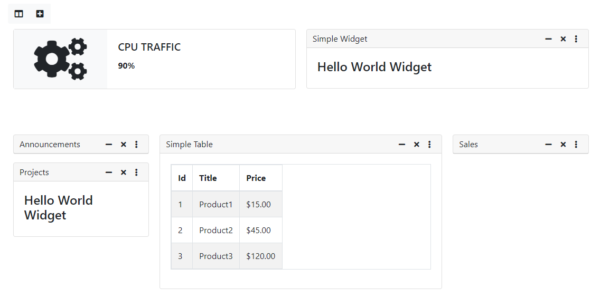

 

# Tu><board

Tuxboard is a dashboard framework specifically for the ASP.NET Core platform. It was meant to be
a Lego-style way to build dashboards.

#### Technology Stack

  - ASP.NET Core 3.1 (using C#)
  - Entity Framework Core 3.1
  - Bootstrap.native 4.x (w/ NO jQuery)
  - FontAwesome 5
  - Web Essentials (for Markdown, Task Runner/Gulp integration, bundler, etc.)
  
#### Features

 * Easily attach a dashboard to your project
 * Customize dashboards for general audiences (a static dashboard), user-based dashboards, or even role-based dashboards (both dynamic dashboards).
 * Extend your dashboard by building dynamic or static widgets.
 * Small, compact code for performance in C# and JavaScript (native JavaScript)
 * While the Tuxboard uses Bootstrap, easily conform Tuxboard to any CSS Framework.

#### Why build a Dashboard framework
In my career, I've built a number of dashboards from scratch. 
As with all projects, each dashboard had pluses and minuses as each project completed.

Even with existing libraries out there, there really wasn't anything out there for the ASP.NET platform.

So the initiative was set to write one.

The developer could start with a simple structure where
ANY type of dashboard could be generated quickly and 
provide an easy front-end with
their own custom widgets and robust layouts.

## Getting Started

Please check the [Wiki](https://github.com/jdanylko/TuxBoard/wiki) for installation.

